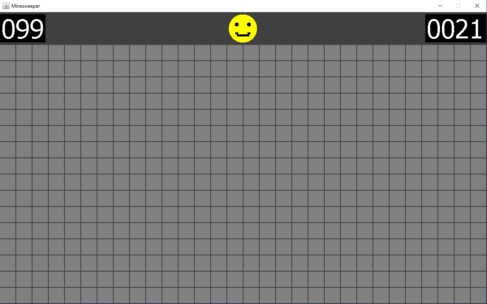
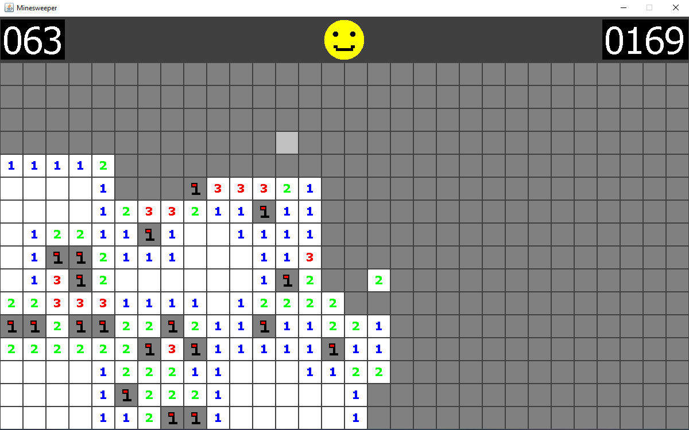
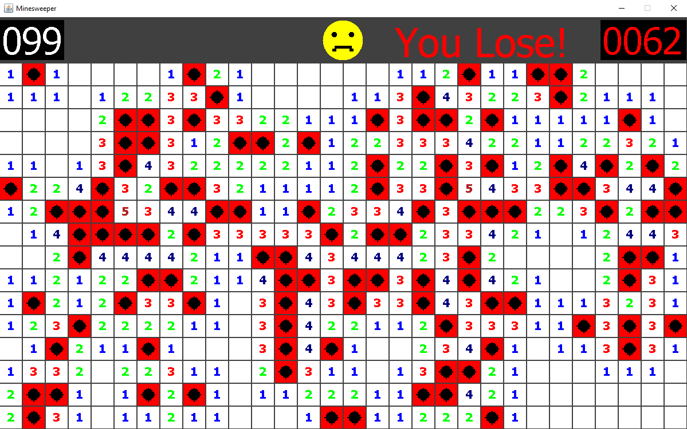

# Java Minesweeper with GUI

Built with Java in Eclipse with JDK 15.0.1, JavaFX 15, JFrame, Jpanel, and Swing. This is similar to traditional Minesweeper games and it has a 30 x 16 grid space. The mines are randomly generated and usually 1/5 of all sqares contain a mine.

## Screenshots

